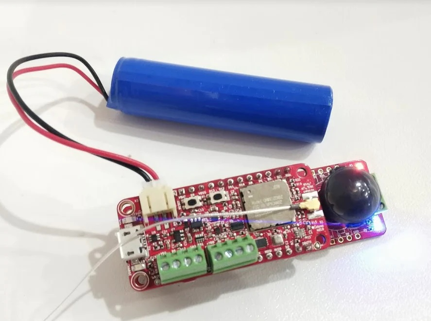

# Catena4430_Sensor

This sketch is actually a fully implemented sensor that uses a 4610 + 4430 to make a mouse/rat activity tracker with LoRaWAN&reg; backhaul and local SD card data storage. You can learn more about this project at [https://mouserat.org](mouserat.org).

This sketch also includes the feature of getting the network time and configuring the RTC.

Data is acquired continuously driven by the polling loop (in Catena4430_cMeasurementLoop.cpp). Various timers cause the data to be sampled. The main timer fires nominally every six minutes, and causes a sample to be taken of the data for the last 6 minutes. The data is then uplinked via LoRaWAN (if provisioned), and written to the SD card (if time is set).

This sketch is the production firmware for the MCCI&reg; [Catena 4430 Animal Activity Sensor](https://store.mcci.com/collections/lorawan-iot-and-the-things-network/products/mcci-catena-4430-activity-sensor-wing).

**Contents:**
<!--
  This TOC uses the VS Code markdown TOC extension AlanWalk.markdown-toc.
  We strongly recommend updating using VS Code, the markdown-toc extension and the
  bierner.markdown-preview-github-styles extension.  Note that if you are using
  VS Code 1.29 and Markdown TOC 1.5.6, https://github.com/AlanWalk/markdown-toc/issues/65
  applies -- you must change your line-ending to some non-auto value in Settings>
  Text Editor>Files.  `\n` works for me.
-->

<!-- markdownlint-disable MD033 MD004 -->
<!-- markdownlint-disable -->
<!-- TOC depthFrom:2 updateOnSave:true -->

- [Introduction](#introduction)
- [Installing and Building](#installing-and-building)
- [Integration with Catena 4610](#integration-with-catena-4610)
- [Overview](#overview)
- [Activities](#activities)
- [Primary Data Acquisition](#primary-data-acquisition)
- [Uplink Data](#uplink-data)
- [Commands](#commands)
	- [`date`](#date)
	- [`dir`, `tree`](#directory)
	- [`log`](#log)
- [Required libraries](#required-libraries)
- [Meta](#meta)
	- [Release Notes](#release-notes)
	- [Trademarks and copyright](#trademarks-and-copyright)
	- [License](#license)
	- [Support Open Source Hardware and Software](#support-open-source-hardware-and-software)

<!-- /TOC -->
<!-- markdownlint-restore -->
<!-- Due to a bug in Markdown TOC, the table is formatted incorrectly if tab indentation is set other than 4. Due to another bug, this comment must be *after* the TOC entry. -->

## Introduction

The MCCI Catena 4430 Animal Activity Tracker is an accessory for Adafruit Feather-compatible CPU boards such as the Adafruit Feather M0 or the MCCI Catena 4610. As the name suggests, it allows real-time tracking of the activity of research animals (mice, rats, and so forth) in cages. Data can be stored in an SD card and also transmitted over LoRaWAN networks such as The Things Network or Helium. Local accessories such as pellet feeders can also be controlled.

The product is available stand-alone, or built up into complete sensors, from the [MCCI Store](https://store.mcci.com/products/mcci-catena-4430-activity-sensor-wing).


With an MCCI Catena 4610 mounted, the assembly looks like this:



Prior to assembly, the Catena 4430 looks like this:


The Catena 4430 adds the following functions to any compatible Feather-like board.

- Passive Infrared (PIR) motion sensor. This can be mounted on the front or back or the board.

- A battery-backed real-time clock (compatible with Adafruit's [Adalogger FeatherWing](https://www.adafruit.com/product/2922)).

- An SD-card slot similar to the Adalogger, but different in a couple of ways. First the SD-card is electrically buffered going to and from the system; it can't interfere with the SPI bus when you're not using it. Second, the SD-card slot has a dedicated power supply that is off by default.

- Three additional lights (red, green, and blue).

- A JST XH-4 receptacle (in older units, a screw terminal) with four posts: two I/O signals, power, and ground. The power at the interconnect can be turned on and off under software control.

## Installing and Building

The best way to install and build this software is to start with [COLLECTION-mouserat-activity](https://github.com/mcci-catena/COLLECTION-mouserat-activity), a top-level collection that includes this repository as a submodule, along with the required libraries and a build procedure that uses the [`arduino-cli`](https://arduino.github.io/arduino-cli/). It is, of course, also possible to install the libraries individually and build with a variety of build procedures. See "[Required libraries](#required-libraries)" for details.

## Overview

The primary function of the Catena 4430 is to capture and transmit real-time animal movement to remote data consumers, using LoRaAWAN. For consistency with MCCI's other monitoring products, information is captured and transmitted at six minute intervals.

This firmware has the following features.

- During startup, the sketch initializes in-built sensors of Catena 4610, RTC and PIR sensor on Catena 4430.

- If the device is provisioned as a LoRaWAN device, it enters the measurement loop.

- The device does not enter deep sleep intead uses Low-Power Timer to sleep for 200 milli-seconds between each poll.

- Temperature, Humidity and Pressure are measured by the BME280.

- Data is encoded into binary and transmitted to the LoRaWAN network, using LoRaWAN port 2 (port 3 if RTC is set using Network time), as a class A device.

- The sketch uses [mcci-catena/mcci-catena-4430](https://github.com/mcci-catena/mcci-catena-4430) library to measure read PIR data, Pellet count and to set/change RTC time.

- The sketch uses the [Catena Arduino Platform](https://github.com/mcci-catena/Catena-Arduino-Platform.git), and therefore the basic provisioning commands from the platform are always available while the sketch is running. This also allows user commands to be added if desired.

- The `McciCatena::cPollableObject` paradigm is used to simplify the coordination of the activities described above.

## Activities

1. [Setup](#setup): an activity that launches the other activities.
2. [Primary Data Acquisition](#primary-data-acquisition): the activity that configures the PIR sensor, and then takes data. It wakes up periodically, poll registers, computes and send an uplink on LoRaWAN.
3. [LoRaWAN control](#lorawan-control): this activity manages transmission and reception of data over LoRaWAN.
4. [Local serial command processor](#commands)
5. *[Future]* A firmware update activity
6. *[Future]* An activity to handle copying firmware

## Primary Data Acquisition

The primary loop wakes up based on elapsed time, makes a series of measurements, scales them, and transmits them.

It senses temp sensor data, light sensor data, PIR sensor (activity) data, pellet feeder data, battery level, and boot count. By default, the cycle time is every six minutes, but this can be adjusted using the cycle-time downlink.

## Commands

In addition to the [default commands](https://github.com/mcci-catena/Catena-Arduino-Platform#command-summary) provided by the library, the sketch provides the following commands:

### `date`

Get or set the date and time in RTC. The clock runs in the UTC/GMT/Z time-zone.

To get the date, enter command `date` on a line by itself.

To set date and time, enter command - `date yyyy-mm-dd hh:mm:ssz`

To set date only, enter command - `date yyyy-mm-dd`

To set time only, enter command - `date hh:mm:ssz`

### `dir`, `tree`

Displays the root directory name OR dirctory of path.

To display the root directory, enter command `dir`.

To display the root directory, enter command `dir`.

To produce a recursive directory list, enter command `tree`.

### `log`

Get or set the debug mask, which controls the verbosity of debug output from the library.

To get the debug mask, enter command `log` on a line by itself.

To set the debug mask, enter <code>debugmask <em><u>number</u></em></code>, where *number* is a C-style number indicating the value. For example, `log 0x0C` is the same as `debugmask 12` -- it turns on bits 2, and 3.

The following bits are defined.

Bit  |   Mask     |  Name        | Description
:---:|:----------:|--------------|------------
  0  | 0x00000001 | `kError`     | Enables error messages
  1  | 0x00000002 | `kWarning`   | Enables warning messages (none are defined at present)
  2  | 0x00000004 | `kTrace`     | Enables trace messages. This specifically causes the FSM transitions to be displayed.
  3  | 0x00000008 | `kInfo`      | Enables informational messages (none are defined at present)

## Required libraries

The following Arduino standard libraries are used in this project.

- SPI
- Wire

The following additional libraries are used in this project.

- [Arduino LMIC](https://github.com/mcci-catena/arduino-lmic/)
- [Arduino LoRaWAN](https://github.com/mcci-catena/arduino-lorawan)
- [Catena Arduino Platform](https://github.com/mcci-catena/Catena-Arduino-Platform)
- [Catena MCCIADK](https://github.com/mcci-catena/Catena-mcciadk)
- [mcci-catena-4430](https://github.com/mcci-catena/mcci-catena-4430)
- [MCCI FRAM I2C](https://github.com/mcci-catena/MCCI_FRAM_I2C)
- [Adafruit_BME280_Library](https://github.com/mcci-catena/mcci-catena/Adafruit_BME280_Library)
- [Adafruit_Sensor](https://github.com/mcci-catena/Adafruit_Sensor)
- [SD](https://github.com/mcci-catena/SD)

## Changing SD Cards While Operating

No problem, but wait for the red light to be out for 5 seconds.

## File format

### Typical File Content

```log
Time,DevEUI,Raw,Vbat,Vsystem,Vbus,BootCount,T,RH,P,Light,P[0].delta,P[0].total,P[1].delta,P[1].total,Act[7],Act[6],Act[5],Act[4],Act[3],Act[2],Act[1],Act[0]
2019-11-19T08:41:03Z,"0002cc010000046b","224afe6d1f7d421d523a1c1af15ea72d7b0062000000000000",4.13,,5.14,28,26.94,17.77,96923.00,98,0,0,0,0,,,,,,,,
2019-11-19T08:51:26Z,"0002cc010000046b","224afe6f8efd3dd83a7b1c194d5ea432270066000000000000cdd4e61dfc53f47f6ff36d15",3.87,,3.65,28,25.30,19.59,96910.00,102,0,0,0,0,,,0.16,0.25,-0.28,-0.54,-0.10,-0.01
```

### Trademarks and copyright

MCCI and MCCI Catena are registered trademarks of MCCI Corporation. LoRa is a registered trademark of Semtech Corporation. LoRaWAN is a registered trademark of the LoRa Alliance.

This document and the contents of this repository are copyright 2019-2022, MCCI Corporation.

### License

This repository is released under the [MIT license](./LICENSE.md). Commercial licenses are also available from MCCI Corporation.

### Support Open Source Hardware and Software

MCCI invests time and resources providing this open source code, please support MCCI and open-source hardware by purchasing products from MCCI, Adafruit and other open-source hardware/software vendors!

For information about MCCI's products, please visit [store.mcci.com](https://store.mcci.com/).
